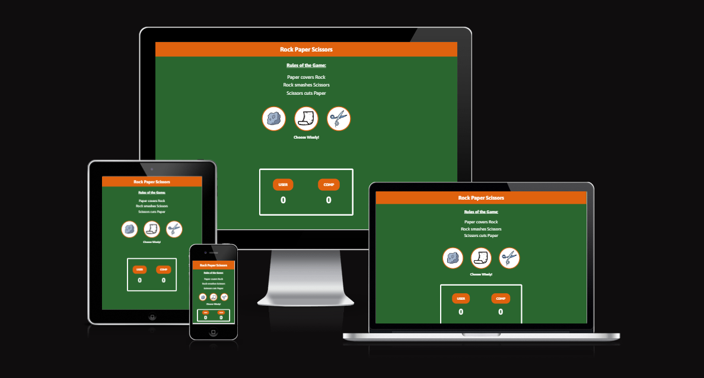
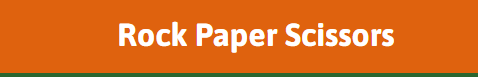
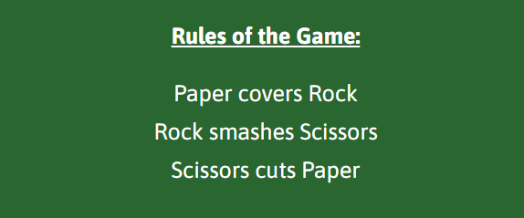
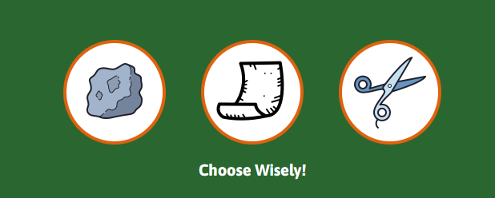
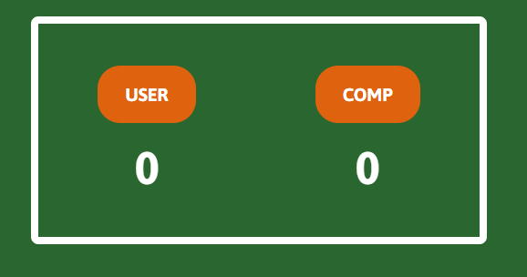
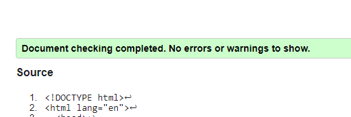
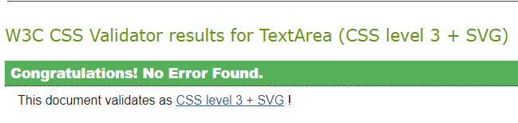
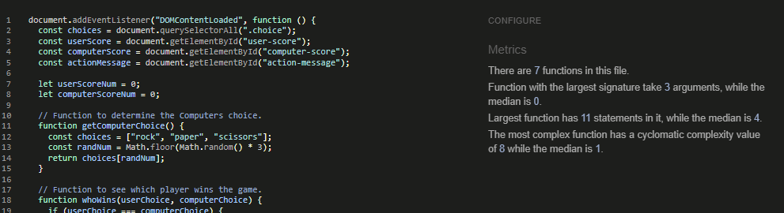
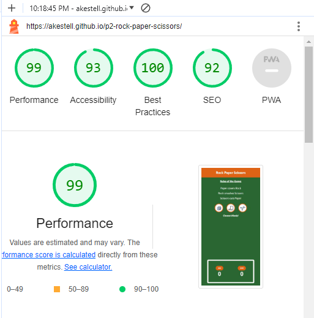

# Rock Paper Scissors Game

A single page website with a game of Rock Paper Scissors.

The goal of the website was to build a simple game using Javascript and to design it to be responsive on different screen sizes. 

This website is curently live and the link to view it can be found here [HERE!](https://akestell.github.io/p2-rock-paper-scissors/)

## Table of Contents

- [Rock Paper Scissors Game](#rock-paper-scissors-game)
  - [Table of Contents](#table-of-contents)
  - [UX](#ux)
    - [Site Purpose](#site-purpose)
    - [Site Goal](#site-goal)
    - [Audience](#audience)
    - [Communication](#communication)
    - [User Goals](#user-goals)
  - [Design](#design)
    - [Color Scheme](#color-scheme)
    - [Typography](#typography)
    - [Imagery](#imagery)
  - [Features](#features)
    - [Future Features](#future-features)
  - [Testing](#testing)
    - [Validator Testing](#validator-testing)
  - [Technologies Used](#technologies-used)
    - [Main languages used](#main-languages-used)
    - [Frameworks, Libraries \& Programs Used](#frameworks-libraries--programs-used)
  - [Deployment](#deployment)
  - [Credits](#credits)
    - [Content](#content)

## UX

### Site Purpose

A simple game of Rock Paper Scissors in which the users plays the game against a computer.

### Site Goal

To showcase a simple game built using Javascript and designed using HTML and CSS.

### Audience

Users looking to beat the odds and outwit the computer in a game of chance!

### Communication

All the information needed to play the game is provided to the user as well as the outcome of each move. 

### User Goals

To try ans best the computer and score higher in Rock Paper Scissors.

## Design

### Color Scheme

I decided to be a bit patriotic and give thego with the color scheme close to the Irish Tricolor.as they are very complimentary.

[Colour palette for the game](assets/images-readme/colour-palette.PNG)

Colour palette was generated from the [Coolors website](https://coolors.co/2a662f-ffffff-df620e-909220-353b3c) 

### Typography

I used the Asap font taken from Google Fonts.

### Imagery

All images for the buttons and for the favicon were downloaded from the [icons8 website](https://icons8.com/)

## Features

A Rock Paper Scissors game that is built on one page and is divided into 4 sections.

- Header at the top of the page with the title of the game centered in the middle of the page. 

- A section just below the header to highlight the rules of the game. 
  

- Image showing the selection buttons for the game.

- The scoreboard at the bottom of the page

### Future Features

Add a timer to the bottom of the page to give the player a timeframe to make a move. 

## Testing

### Validator Testing

- html files all went through the [W3C validator](https://validator.w3.org/) with no issues in them.
  

- css files also passed all tests when ran through [Jigsaw validator](https://jigsaw.w3.org/css-validator/)
  

- jscode showed no errors when ran through [JSHint](https://jshint.com/)
  

- Lighthouse test returned a very high rating for the site. In particualr a high Accessability Score
  

- Tested on Chrome, Firefox & Safari and worked without issues
- Links to external pages all open to required location.

## Technologies Used

### Main languages used

- HTML 5
- CSS 3
- Javascript

### Frameworks, Libraries & Programs Used

- Google fonts - Used for the font family 'Roboto' which is used throughout the site.
- Font Awesowe - Each of the social media icons in the footer where taken from there.
- GitHub - used to store repo for project submission
- Codeanywhere - to create html and css files.
- Icons8.com - Used to obtain the favicon at the top of the page.
- Am I responsive - to make sure the project looked good on all screen sizes.

## Deployment

The site was deployed to GitHub pages. The steps to deploy are as follows:

- In the GitHub repository, navigate to the Settings tab
- From the source section drop-down menu, select the Master Branch
- Once the master branch has been selected, the page will be automatically refreshed with a detailed ribbon display to indicate the successful deployment.
- The live link can be found [HERE](https://akestell.github.io/p2-rock-paper-scissors/)

## Credits

### Content

- The initial set up for the html and css was taken from a guide [JavaScript, HTML, CSS - Rock Paper Scissors Game](https://www.youtube.com/watch?v=jaVNP3nIAv0)
- I used the following video to help with certain parts of the JS code [How To Code Rock Paper Scissors In JavaScript](https://www.youtube.com/watch?v=1yS-JV4fWqY)
